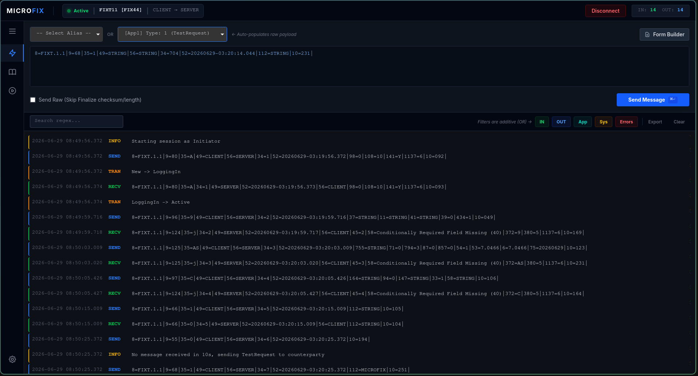
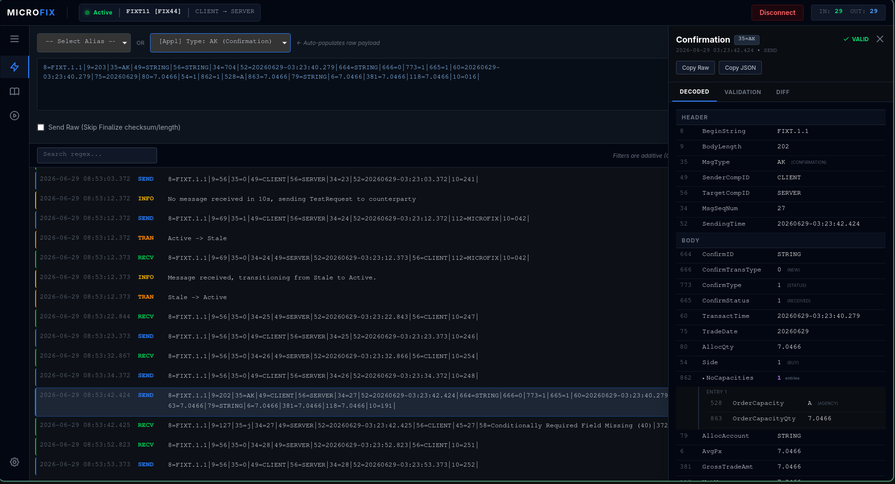
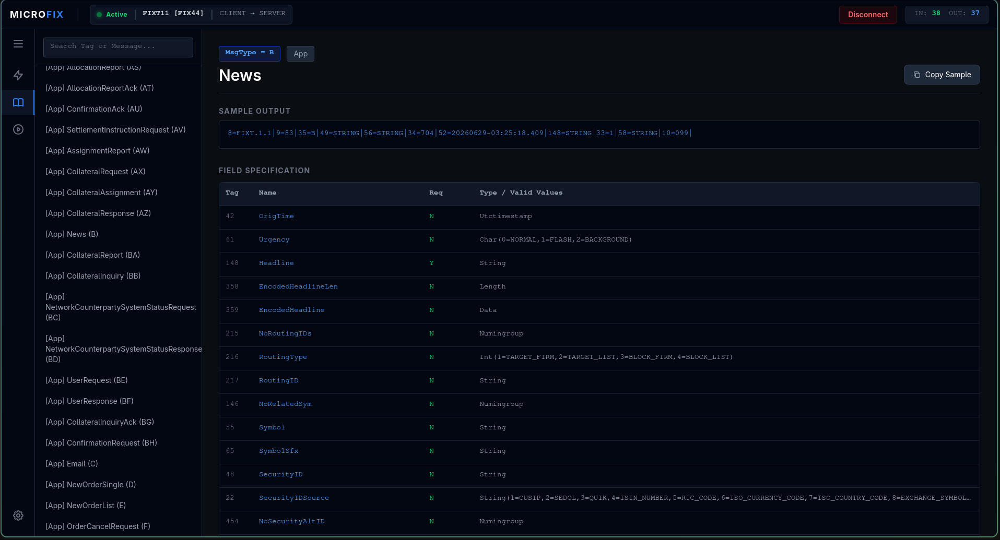
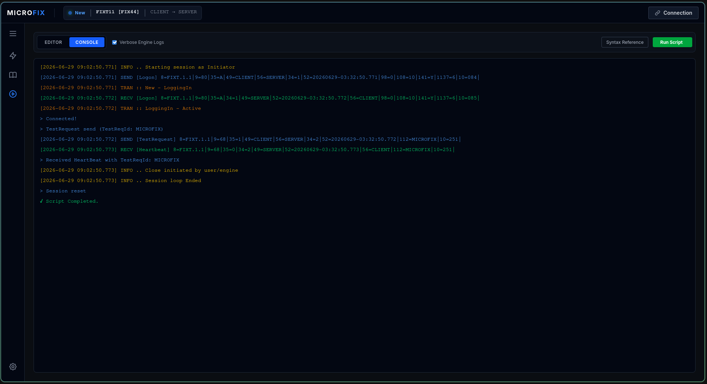
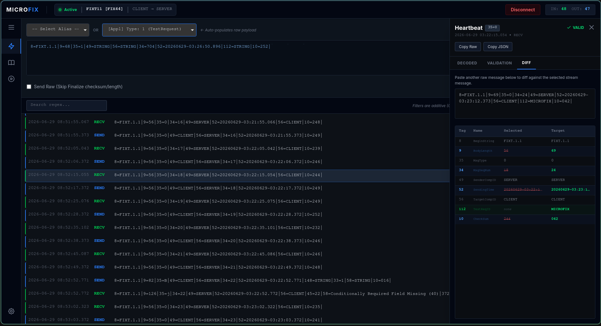
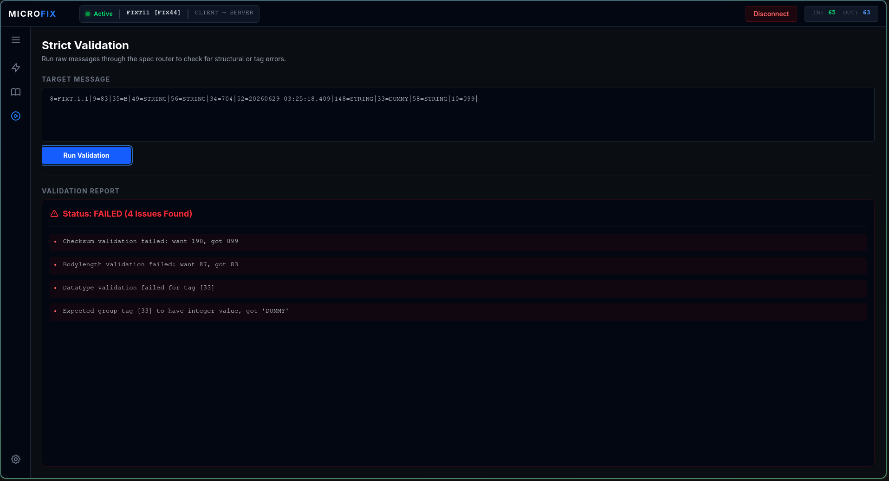

<p align="center">
  
</p>

<h1 align="center">MicroFIX</h1>

<p align="center">
A high-performance FIX (Financial Information eXchange) workstation suite for developers, testers, and quants.
</p>

<p align="center">
  
  
  
</p>

> **One scripting engine, one protocol engine, two user interfaces.**
> Both MXGUI and MXShell are thin front-ends over the same deterministic core, ensuring identical behavior whether you are debugging interactively or running automated CI tests.

---

## GUI Demo
<div align="center">
  <h3><a href="https://github.com/user-attachments/assets/cc71c724-28a4-4fa6-9775-c6da18e87696">MXGUI: Graphical User Interface</a></h3>
  <video src="https://github.com/user-attachments/assets/cc71c724-28a4-4fa6-9775-c6da18e87696" controls muted autoplay playsinline width="800"></video>
</div>

---

## Feature Gallery

|                                                         |                                                            |
|---------------------------------------------------------|------------------------------------------------------------|
| **Live Session Monitor**                                | **Message Inspector**                                      |
|          |  |
| **Dictionary Browser**                                  | **Script Runner**                                          |
|        |   |
| **Message Diff**                                        | **Offline Toolbox**                                        |
|  |            |

---

## Why MicroFIX?

Developing FIX applications often means switching between packet captures, text logs, XML dictionaries, and ad-hoc test scripts. MicroFIX brings everything together in a single native application, combining live monitoring, message inspection, scripting, and protocol tooling into one consistent workflow.

* **Test FIX Venues:** Simulate counterparties and validate raw FIX logs.
* **Inspect Deeply:** Visual tree views for repeating groups and side-by-side message diffs.
* **Automate Reliably:** Deterministic scripting with `wait`, `expect`, assertions, and variable injection.
* **Continuous Logging:** Live log streaming that remains uninterrupted even during session reconnects and resets.
* **Explore Dictionaries:** Browse message and field definitions with one-click message sampling.
* **Offline Utilities:** Offline toolbox for decoding, validation, comparison and message generation.

---

## Highlights

- Native desktop application (no Java, no Electron)
- Interactive CLI with scripting support
- Deterministic scripting
- Offline FIX toolbox
- Interactive FIX dictionary browser
- Custom FIX XML support
- Shared engine between GUI and CLI

---

## Installation

Download the latest pre-compiled binaries from the [Releases](https://github.com/Infinage/microfix/releases) page, or install directly via Go:

```bash
go install github.com/Infinage/microfix/cmd/mxshell@latest
go install github.com/Infinage/microfix/cmd/mxgui@latest

```

### Build from Source

**Desktop GUI (`mxgui`)** (Requires CGO & WebKitGTK on Linux / macOS support via Wails v3):

```bash
go build -tags desktop,production -ldflags="-s -w" -o mxgui ./cmd/mxgui

```

**CLI (`mxshell`)**:

```bash
CGO_ENABLED=0 go build -ldflags="-s -w" -o mxshell ./cmd/mxshell

```

---

## Quick Start

Get connected and send your first message in 2 minutes.

### 1. Configuration

Both `mxshell` and `mxgui` automatically load configuration from:

```text
~/.mxrc
./.mxrc
```

If neither file exists, MicroFIX starts with sensible defaults.

By default, MicroFIX uses:

| Setting | Default |
|---------|---------|
| SenderCompID | `SENDER` |
| TargetCompID | `TARGET` |
| FIX Version | `FIX44` |
| Heartbeat Interval | `30s` |
| Listen Address | `0.0.0.0:1234` |
| Script Timeout | `5s` |
| Validation Mode | `Strict` |

You can modify the configuration:

- **MXGUI:** Session Settings page
- **MXShell:** `config` command
- **Manually:** Edit `~/.mxrc`

### 2. Start a Session (CLI Example)

```bash
$ mxshell

# Connect to the target defined in config
mxshell> connect

# Send a raw message
mxshell> send 35=A|98=0|108=30|

# Print the logs
mxshell> logs
```

---

## Capabilities

### Desktop GUI (`mxgui`)

* **Live Session Monitor:** Zero-lag log streaming via Server-Sent Events capable of handling thousands of messages.
* **Interactive Message Diff:** Compare FIX messages side-by-side to instantly spot protocol differences.

#### Message Inspector

Expand repeating groups, inspect components, and compare FIX messages side-by-side with decoded tag names and metadata.

#### Dictionary Browser

Search by tag, field name, message type, or component directly from the official FIX XML specs.

### Interactive Shell (`mxshell`)

<div align="center">
  <h3><a href="https://github.com/user-attachments/assets/74aa908e-ef16-4a6f-8be0-2ee49c3f57cd">MXShell: Command Line Interface</a></h3>
  <video src="https://github.com/user-attachments/assets/74aa908e-ef16-4a6f-8be0-2ee49c3f57cd" controls muted autoplay playsinline width="800"></video>
</div>

* **Smart REPL:** Command history, arrow-key navigation, and smart auto-completion.
* **Headless Automation:** Execute batch `.mxs` scripts for CI/CD pipelines.
* **Log Management:** Live log streaming, regex searches, and file export.
* **Alias support:** Reusable FIX templates with macro support

### Productivity & Scripting

Messages sent from both MXGUI and MXShell support the same expression and macro substitution engine.

#### Deterministic Scripting

Scripts can be executed directly from MXGUI or MXShell using the exact same deterministic engine. Wait for and assert on specific message criteria using boolean logic:

```bash
connect
waitstatus Active

set VARS.counter 0
set VARS.max_orders 5

# Execute a batch of orders and verify acknowledgments
while assert $VARS.counter < $VARS.max_orders
    # Route order with a dynamically generated ClOrdID
    send 35=D|11=$UNIQUE|55=AAPL|54=1|38=100|40=2|
    
    # Wait for the Execution Report (Order ACK)
    if wait "35=8 & 39=0"
        print Order $VARS.counter acknowledged with ExecID: $BUF.17
        incr VARS.counter
        sleep 500
    else
        print ✗ Order acknowledgment timed out!
        disconnect
        exit
    endif
endwhile

print ✓ Successfully routed $VARS.counter orders.
disconnect

```

<div align="center">
  <h3><a href="https://github.com/user-attachments/assets/8fa59d40-7dfa-4b31-8fe4-5d79fbc22744">MXGUI: Script runner example</a></h3>
  <video src="https://github.com/user-attachments/assets/8fa59d40-7dfa-4b31-8fe4-5d79fbc22744" controls muted autoplay playsinline width="800"></video>
</div>

#### Global Variables

Inject dynamic values into scripts, CLI commands, or GUI inputs using the `$` prefix.

| System & State | Context & Store |
| --- | --- |
| `$UNIQUE` (Random UUID) | `$CFG.<key>` (Config values) |
| `$TIMESTAMP` (UTC YYYYMMDD-HH:MM:SS) | `$VARS.<key>` (Script-defined values) |
| `$DATE[+N]` (Date offset by N days) | `$ALIAS.<name>` (Saved aliases) |
| `$STATUS` (Session State) | `$ENV.<name>` (Environment variables) |
| `$SEQ_IN` / `$SEQ_OUT` | `$LASTIN[T,t]` / `$LASTOUT[T,t]` (Tag `t` from last MsgType `T`) |

#### Aliases

Aliases allow frequently used FIX messages to be reused with parameter substitution.

```bash
# Define the alias
set $ALIAS.AAPL 35=D|55=AAPL|54=1|38=500|40=2|

# Invoke it in MXShell
send -a AAPL

# Invoke in scripts
send $ALIAS.AAPL
```

### Shared Protocol Engine

* **Dictionary based validation:** MicroFIX supports multiple validation levels (None, Basic, Strict) backed by custom XML dictionaries.
* **Automatic Admin Handling:** Automatically manages Logon, Logout, Heartbeats, Test Requests, and Sequence Resets.
* **Flexible Input:** Paste raw `35=D|55=AAPL|...` and MicroFIX converts delimiters, computes `BodyLength`, and calculates `CheckSum` on the fly.
* **Consistency:** Both MXGUI and MXShell use the exact same parser, validator, scripting engine, and session implementation.

---

## Supported FIX Versions

MicroFIX is fully dictionary-driven. It supports standard FIX versions natively and can load custom XML dictionaries for venue-specific extensions or proprietary dialects.

Use the following exact values to load the internal dictionaries:

| Protocol | Spec Config Value |
| --- | --- |
| FIX 4.0 | `FIX40` |
| FIX 4.1 | `FIX41` |
| FIX 4.2 | `FIX42` |
| FIX 4.3 | `FIX43` |
| FIX 4.4 | `FIX44` |
| FIXT 1.1 | `FIXT11` |
| FIX 5.0 | `FIX50` |
| FIX 5.0 SP1 | `FIX50SP1` |
| FIX 5.0 SP2 | `FIX50SP2` |

> **Custom Dictionaries:** You may also provide an absolute or relative path to a custom XML file if your venue requires a modified dialect.

---

## Continuous Integration

MicroFIX scripts are deterministic and designed to run headless inside CI pipelines. If a `wait`, `expect`, or `assert` command fails, `mxshell` immediately exits with a non-zero status code, failing your pipeline build.

**Example GitHub Actions Workflow:**

```yaml
name: FIX Protocol Regression
on: [push]

jobs:
  test-fix-flows:
    runs-on: ubuntu-latest
    steps:
      - uses: actions/checkout@v4
      
      - name: Install MicroFIX
        run: go install github.com/Infinage/microfix/cmd/mxshell@latest
        
      - name: Run Order Flow Test
        run: mxshell -f tests/new_order_single.mxs
```

---

## Architecture

```text
cmd/mxgui       Desktop GUI application and script runner
cmd/mxshell     Interactive CLI REPL and headless automation
pkg/session     Core engine utilizing an actor model to power FIX sessions
pkg/executor    Script parsing and evaluation API invoked by both frontends
pkg/ast         Abstract Syntax Tree powering flexible `wait`/`expect` expressions
pkg/macros      Dynamic variable substitution engine
pkg/message     FIX message structures powering the entire suite
pkg/spec        XML dictionary parser providing schema data structures
pkg/store       In-memory state management (configs, variables)
pkg/broker      Pub/sub event broker handling smooth log streaming and reconnects
pkg/ringbuf     Efficient circular buffer for CLI log history
pkg/transport   Low-level TCP/network API utilized by the session engine
pkg/pretty      Console formatting utilities

```

---

## Roadmap

* [ ] macOS Support
* [ ] Script debugger with LSP-like support
* [ ] Replay recorded FIX sessions
* [ ] Multiple simultaneous sessions
* [ ] Performance improvements

---

## Contributing

Contributions, bug reports, and feature requests are welcome!

If you work with FIX every day and want a faster alternative to heavyweight legacy tooling, give MicroFIX a try. If you are interested in FIX tooling or high-performance Go development, feel free to open an issue or submit a pull request.

---

## Acknowledgements

MicroFIX is built using Go, Wails, HTMX, and Tailwind CSS.

---

## License

MIT License
